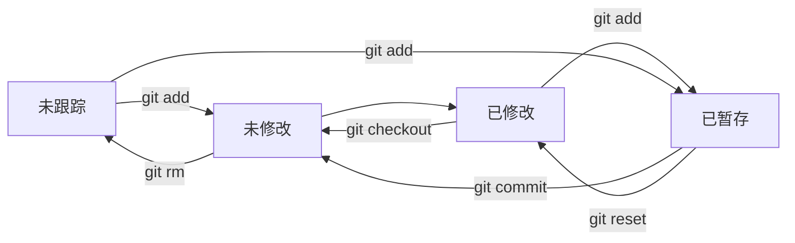

# Git基础
## git的工作区域和文件状态

### 工作区域


* 工作区：当前项目的文件目录，是开发者直接编辑代码的地方。
* 暂存区：用于临时存放即将提交的改动。
* 本地仓库：存储项目完整历史和元数据的数据库（位于 `.git` 目录中）。

### 文件状态



* Untrack（未跟踪）
* Unmodified (未修改)
* Modified (已修改)
* Staged (已暂存)

## 基本命令

### `git config` 配置信息

#### 参数

* 无 本地仓库有效。

* `--global`  全局配置，所有仓库生效。

  ```bash
  git config --global user.name "name"
  git config --global user.name "exp@qq.com"
  ```

* `--system` 系统配置，对所有用户生效。

* `--list` 列出配置信息。

  ```bash
  git config --system --list
  git config --global --list
  git config --list
  ```
  

### `git init` 创建仓库

```bash
git init #在当前目录创建
git init my_test #在my_test目录创建
```

**注意: ** 删除 .git 文件后，就删除了仓库。

### `git status` 查看仓库状态

#### 参数

* `-s` 简略查看 

### `git add` 添加至暂存区

```bash
git add <file>
git add *
```

### `git commit` 提交

#### 参数 

* `-a` 同时暂存并提交

* `-m` 指定提交信息。

  ```bash
  git commit -m "Message"
  ```

* 无参数 会使用vim 让你在开头输入提交信息。

### `git log` 查看历史提交记录

#### 参数

* `--oneline` 查看简洁提交记录。

### `git ls-files`  **列出 Git 跟踪的文件**

显示 Git 仓库中已跟踪文件的列表，包括已修改、已暂存和已提交的文件。

### `git reset` 版本回退

#### 参数

* `--soft`  保留工作区和暂存区。
* `--hard`  不保留工作区和暂存区。
* `--mixed`只保留工作区(默认)。

```bash
git reset --soft ID
```

#### 查看图形化结构

```bash
git log --oneline --graph --decorate --all
```

#### `--hard`  误操作回退

##### `git reflog` 查看操作历史记录

```bash
git reflog #查看操作历史记录,找到操作的ID
git reset --hard ID # 使用git reset回退
```

### `git diff` 比较差异

#### 信息格式

```bash
diff --git a/2.txt b/2.txt 
index 00b30ed..d1019e1 100644 #index 后是文件hash，10644为权限
Binary files a/2.txt and b/2.txt differ
```

#### 参数

* 无  比较工作区和暂存区差异

  ```bash
  git diff
  ```

* `HEAD` 比较版本库和工作区的差异

  ```bash
  git diff HEAD
  ```

* `--cached` 比较暂存区和版本库的差异

	```bash
	git diff --cached
	```
	
* `--staged`和`--cached` 一样

* 比较两个版本差异

  ```bash
  git diff <ID 1> <ID 2> #两个版本比较
  git diff <ID> HEAD #和HEAD比较
  git diff HEAD HEAD~ #当前版本和上一个版本
  git diff HEAD HEAD~2#当前版本和上上个版本 一次类推
  ```

* 比较文件内容

  ```bash
  git diff HEAD HEAD~ <filename>
  ```

* 比较分支

  ```bash
  git diff <branch_name> <branch_name>
  ```


### `git rm`

#### 参数

* 无 同时删除暂存区和工作区

  ```bash
  git rm  <filename>
  ```

* `--cached` 从暂存区删除，保留工作区

  ```bash
  git rm --cached <filename>
  ```

* `-r`  递归删除

  ```bash
  git rm -r *
  ```

**注意: ** 删除后记得提交。

#### 其他删除方法

```bash
rm <filename> #先删除工作区
git add <filename> #在删除暂存区
```

### .gitignore 忽略文件

将不被管理的文件名，写入.gitignore文件中，使其不被git管理。

```bash
vim .gitignore #可使用标准Blob模式匹配
---

err.log #忽略err.log 文件
*.txt #忽略所有.txt文件
test/ #忽略test文件夹
/test #忽略test文件夹下的文件，不忽略test
```

#### 匹配规则

* 空行和#开头会忽略
* 可使用标准Blob模式匹配
	* 如：`*` ` ?`  `[abc]` 

### `git clone` 拉去文件

```bash
git clone address
```
### `git push` 更新远程仓库

```bash
git push <remote>
```

#### 参数

* `-u` 添加远程仓库

  ```bash
  git push <远程仓库名> <分支名>
  ```

### `git pull` 拉取远程仓库

```bash
git pull <远程仓库名> <远程分支名>:<本地分支名>#相同可省略
```

### `git remote`

#### 参数

* `add` 添加远程仓库

  ```bash
  git remote add <远程仓库名> <远程仓库地址>
  ```

* `-v` 查看远程仓库

  ```bash
  git remote -v  
  ```

* `rm` 删除远程仓库

  ```bash
   git remote rm origin
  ```

* `set-url` 重新设置远程厂库

  ```bash
  git remote set-url origin https://gitee.com/xx/xx.git (新地址)
  ```

  

### `git branch` 

#### 用法

* 查看分支列表

  ```BASH
  git branch
  ```

* 创建分支

  ```
  git branch <branch-name>
  ```

* 删除分支

  ```bash
  git branch -d <branch-name> #删除已合并
  git branch -D <branch-name> #删除未合并
  ```

  

### `git switch` 切换分支

```bash
git switch <branch-name>
```

### `git merge` 

#### 用法

* 合并分支

  ````bash
  git merge <branch-name>
  ````

​	**注意：**`git merge`合并分支必须在

* 终止合并

  ```bash
  git merge --abort 
  ```

#### 分支合并冲突处理

1. 手动修改冲突文件，合并冲突内容
2. 然后将该文件添加至暂存区
3. 提交修改

不想继续合并可以使用**终止合并**的命令。

#### 优缺点

**优点：** 不会破坏分支的提交历史，方便回溯和查看。

**缺点**：会产生额外的提交节点，分支图比较复杂。.

### `git rebase` 

#### 优缺点

**优点：**不会新增额外提交记录，形成线性历史，比较直观

**缺点：**会改变提交历史，改变当前分支branch out的节点，比卖在共享分支使用。

## Git 工作流模型

### GitFlow

### GitHubFlow

